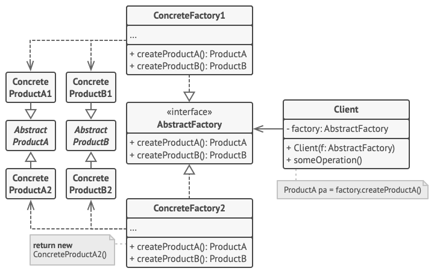

# Pattern Abstract Factory 🏭

> **Factory method** - refers to creational design patterns family. This pattern allows you to create a families of
> connected objects. Without binding to specific classes of created objects.

**Pattern structure :**

**Pattern implementation steps :**

1. Create interfaces for all abstract products.
2. Create interface for abstract factory.
3. Create concrete factories which will be implements abstract factory and return concrete product.
4. Create all concrete products which will be implements abstract product.
5. Create function which will be got one of factory object as a parameters and create an object with the product data
   that the client needs.

**Pros and cons :**

👍 - Guarantees the compatibility of products created.\
👍 - Class avoid from bounding with concrete product class.\
👍 - Collect code with products in one place that simplify code support.\
👍 - Simplify adding new products in the app.\
👍 - Implements second SOLID principle - Open/Closed.

👎 - Complicates the program code by introducing many additional classes.\
👎 - Needs all kinds of products in every factory.

**Visual representation of the implementation using a table**:

| AbstractFactory    |  AbstractUANCurrency   |    AbstractUSDCurrency |
|--------------------|:----------------------:|-----------------------:|
| SimpleUserFactory  | SimpleUserUANCurrency  |  SimpleUserUSDCurrency |
| PremiumUserFactory | PremiumUserUANCurrency | PremiumUserUSDCurrency |
