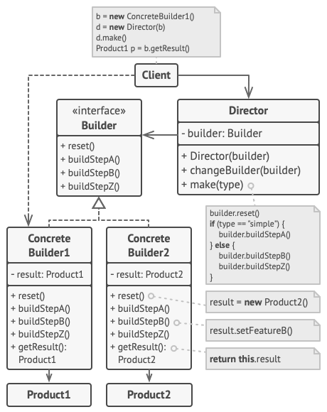

# Pattern Builder 🔨

> **Builder** - refers to creational design patterns family.This pattern allows to create complicated object step by step.
> Builder allow to use the same building code for create different object views.

**Pattern structure :**

**Pattern implementation steps :**

1. Create product class with methods for retrieving the results. This class will be expanded by builder in the future.
2. Create builder interface.
3. Create concrete builder class which will be implements builder interface.
4. Inside concrete builder we need to create blank product object, which is used in further assembly.
5. Create director class which will be responsible for executing the builder steps in a particular sequence. Director 
class is optional because the client can control builders directly.
6. In client code need to create instance of director and instance of concrete builder. Use method setBuilder in director 
instance set the builder in director instance.
7. Now can call director methods of concrete products and got result at the end.

**Pros and cons :**

👍 - Allows to create product step by step.\
👍 - Allows to use the same code for create different products.\
👍 - Isolates complex product build code from business logic.\

👎 - Complicates the program code by introducing many additional classes.\
👎 - Client will be bind to concrete builder classes.