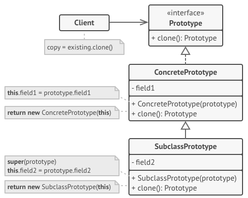

# Pattern Prototype 🚗🚕

> **Prototype or Clone** - refers to creational design patterns family.This pattern allows to copy objects without going into the 
> details of the implementation.

**Pattern structure :**

**Pattern implementation steps :**

1. Create interface with clone method for prototype class.
2. Create prototype class which implements cloneable interface.
3. In method clone need to return instance of current class.

**Pros and cons :**

👍 - Allows to create product avoid bounding with concrete class.\
👍 - Less repetitive code to initialize objects.\
👍 - Speeds up the creation of objects.\
👍 - Alternative to create subclasses for construct complicated objects.\

👎 - It is difficult to clone composite objects that have references to other objects.\