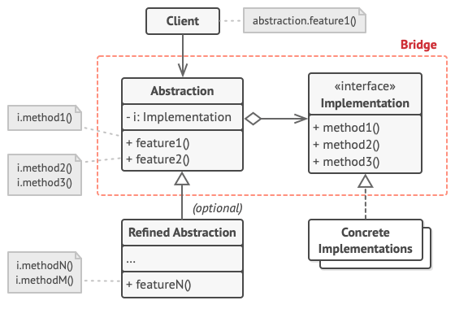

# Pattern Bridge 🌉

> **Bridge** - is a structural design pattern that divides business logic or huge class into separate class hierarchies 
> that can be developed independently.

**Pattern implementation steps :**

1. Find classes which you need separate on abstraction and implementation.
2. Define abstraction and implementation abstract classes.
3. Inside the abstraction class, add a reference field for the implementation type. The abstraction delegates most of 
the work to the implementation object that’s referenced in that field.
4. Concrete classes needs to be extends from abstract classes abstraction or implementation.
5. The client code should pass an implementation object to the abstraction’s constructor to associate one with the 
other. After that, the client can forget about the implementation and work only with the abstraction object.

**Pros and cons :**

👍 - Allow to create platform independent platform and apps.\
👍 - The client code works with high-level abstractions. It isn’t exposed to the platform details.\
👍 - Open/Closed Principle. You can introduce new abstractions and implementations independently from each other.\
👍 - Single Responsibility Principle. You can focus on high-level logic in the abstraction and on platform details in 
the implementation.

👎 - Complicates the program code by introducing additional classes.