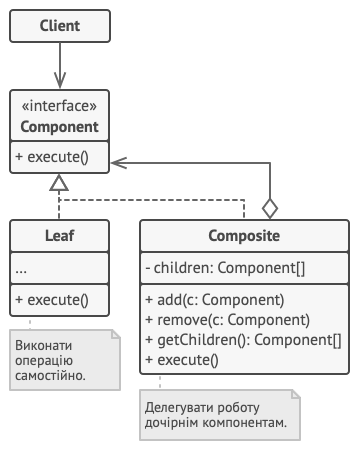

# Pattern Composite 🌳

**Composite** - is a structural design pattern that allow you to create a tree of objects and works with it in the same 
way as with a single object.

**Pattern implementation steps :**

1. Create abstract class component with all methods which you need in a leafs and composite classes.
2. Create classes for leaf and composite which will be extended from component class.
3. Inside the leaf and composite class you need to implement abstract methods from component class.
4. Add methods for add and remove children components to the composite class.

**Pros and cons :**

👍 - Simplifies client architecture when working with a complex component tree.\
👍 - Makes it easier to add new types of components.

👎 - Creates too general a class design.