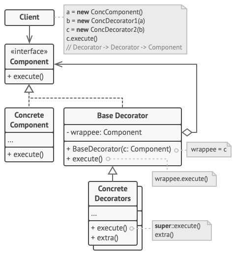

# Pattern Decorator 🎭 

> **Decorator or Wrapper** - is a structural design pattern that allow dynamically to add new functionality for objects by wrapping
them in useful wrappers. 

**Pattern implementation steps :**

1. Create general interface for decorator classes and simple.
2. Create class implemented general interface for simple class.
3. Create class implemented general interface for base decorator class.
4. Create one or more decorators extends from decorator base class.  
5. The client can wrap object in decorators and get new functionality for the object.

**Pros and cons :**

👍 - More flexibility than inheritance.\
👍 - Allow to add responsibility on the fly.\
👍 - Сan add several new responsibilities at once.\
👍 - Allow to have many small objects instead of one big object.

👎 - Difficult to configure object with many wrappers.
👎 - Many small classes.