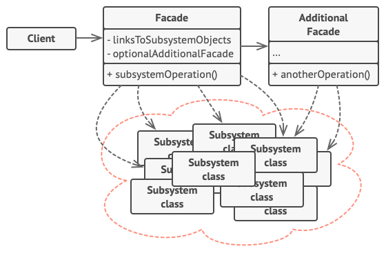

# Pattern Facade 🏰 

**Facade** - is a structural design pattern that provides simple interface for complex system of classes, library or 
framework. 

**Pattern implementation steps :**

1. Create interface for facade class.
2. Create facade class which implements interface above.
3. Inside facade class you need to hide some logic and use different separate classes or services. Client don't need to 
know about classes or services witch we will use under the hood.
4. For the clients we show only facade class with some methods which combine logic inside and return result.

**Pros and cons :**

👍 - Isolate clients from complicate components of the subsystems.

👎 - The facade can become a "Divine object" that will be tied to all classes of the program.