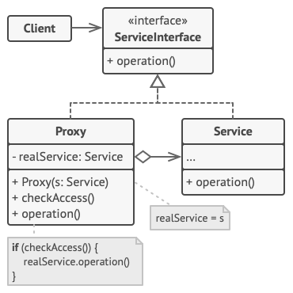

# Pattern Proxy 🔐

> **Proxy** - is a structural design pattern that allow to replace real objects used special replace objects. This 
> objects catch the call to original objects and allow to do something before and after the original objects' call is 
> passed.

**Pattern implementation steps :**

1. Create interface for our subject and proxy classes.
2. Create subject class implemented interface.
3. Create proxy class implemented interface.
4. Proxy constructor accepts subject class as an argument.
5. Create method which we need. And organize call methods from subject class and proxy like you need.

**Pros and cons :**

👍 - Allow to control service object unnoticed by the client.\
👍 - Can work when service object not created yet.\
👍 - Can to control life cycle of service object.\
👍 - Can to control life cycle of service object.

👎 - Complicates the program code by introducing additional classes. 
👎 - Increases the response time from the server. 